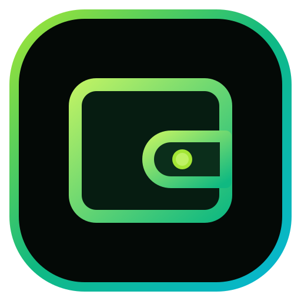

# SpendWise — Intelligent Expense & Budget Tracker

<div align="center">



### *Sleek. Fast. Offline-First. Built with a Dark Emerald Liquid-Glass Aesthetic.*

[](SpendWise-ExpenseTracker.apk)
[](https://react.dev/)
[](https://www.typescriptlang.org/)
[](https://tailwindcss.com/)
[](https://capacitorjs.com/)
[](https://dexie.org/)
[](tests/)

[**📥 Download Latest Android APK**](SpendWise-ExpenseTracker.apk) • [**✨ Features**](#-complete-features-overview) • [**📱 Widgets**](#-3-native-android-home-screen-widgets) • [**👨‍💻 Developer**](#-built-by-anjana-sithum)

</div>

---

## 👨‍💻 Built by Anjana Sithum

<div align="center">


### **Made By Anjana Sithum**


*"SpendWise was designed and engineered from the ground up to redefine personal financial tracking: combining unmatched 120fps mobile performance, total offline privacy, hardware-accelerated liquid-glass visuals, a polished branded launch experience, and seamless Android home screen widgets."*

</div>

---

## 🌟 Overview

**SpendWise** is a high-performance personal expense and budget management application built for Android and modern mobile web platforms. Crafted with an immersive **OLED Dark Emerald & Lime Liquid-Glass** design system, SpendWise delivers an instantaneous, tactile user experience with zero tracking, zero cloud dependencies, and full native hardware integration.

Every detail has been polished — from the **branded emerald splash screen** visible at the very first frame of launch, to zero-flash keyboard interactions, to three native Android home screen widgets that surface live financial data directly from your phone's home screen.

---

## ✨ Complete Features Overview

### 1. 📊 Interactive Dashboard & Financial Pulse
- **Real-Time Counters**: Instant visibility over **Today's Spending** and **Month-to-Date Spend** with fluid animated number rolling transitions.
- **Dual-Wave Spline Graph**: Hardware-accelerated canvas chart visualizing spending trends, accumulation velocity, and comparison over time.
- **Fluid Segmented Subviews**: Seamlessly flip between:
  - **Savings**: Monthly total, daily pace, and trajectory chart.
  - **Calendar**: Interactive day-by-day expense tracker (see below).
  - **Footprint**: Spending distribution breakdown across essentials, lifestyle, and savings.
  - **Bills**: Automatic recurring utility, rent, and subscription pattern detection.

### 2. 📅 Day-by-Day Interactive Expense Calendar
- **Full Month View**: Navigate past, present, and future months with smooth pagination and a 1-tap "Today" shortcut.
- **Activity Indicators**: Glowing emerald dots highlight every date that has recorded expenses.
- **Day-Filtered Transaction Stream**: Tap any calendar day to instantly filter the transactions list to only expenses logged on that date, along with that day's exact total.
- **Contextual Fast-Add**: Tap **+ Add Expense for [Date]** to launch the entry modal pre-filled with the tapped day — no manual date picking needed.

### 3. 🎯 Smart Monthly Budgeting & 1st-of-Month Planning
- **Dual Budget Architecture**: Set a **Default Baseline Budget** during onboarding that auto-applies as the initial monthly budget target every month.
- **1st Day of Month Planning Prompt**: On the first calendar day of every new month (or the first app launch of a new month), SpendWise asks:
  > *"Welcome to [Month]! What is your estimated budget for this month?"*
- **Quick Preset Chips**: Pre-filled with your baseline target, with `Same as Default`, `+10%`, and `−10%` estimation shortcuts.
- **Real-Time Allowance Monitoring**: Dynamic calculation of remaining allowance, percentage consumed, and color-coded status badges (`SAFE • ON TRACK`, `CAUTION`, `OVER BUDGET`).
- **Manual Override in Settings**: Update the current month's budget or default baseline at any time from the Settings screen.

### 4. 📱 3 Native Android Home Screen Widgets
SpendWise features three native Android widgets so your financial metrics are visible right from your home screen — no need to open the app:

| Widget | Size | Key Capabilities |
| :--- | :---: | :--- |
| **SpendWise Daily Glance** | 4×2 | • Today's spending + month-to-date total<br>• Current date display<br>• 1-tap **`+ Add`** shortcut → opens expense entry modal<br>• 1-tap **`History`** shortcut → opens transactions list |
| **SpendWise Budget Pulse** | 2×2 | • Real-time remaining monthly budget counter<br>• Monthly % used progress bar<br>• Dynamic health status pill (`SAFE`, `CAUTION`, `OVER BUDGET`) |
| **SpendWise Quick Action Dock** | 4×1 | • Horizontal pill dock with SpendWise emblem<br>• Today's spending live counter<br>• Direct shortcuts for **Food**, **Travel / Commute**, and **Quick Add** |

*All widgets sync instantly with the app via a native `@JavascriptInterface` zero-latency bridge.*

**How to Add Widgets:**
1. Install and open SpendWise at least once to initialize your data.
2. Long-press any empty space on your Android home screen.
3. Tap **Widgets** → scroll to **SpendWise**.
4. Choose your widget and drag it onto the home screen.

### 5. ⚡ Fast Expense Logging & Management
- **Bottom Sheet Entry Modal**: Tap the **+** button for a smooth slide-up sheet to log amount, category, date, time, payment method, and optional note.
- **Quick Amount Chips**: Tap +50, +100, +200, +500, +1000, +2000 preset chips to populate the amount field instantly.
- **28 Real-World Categories** with color-coded icons (see full list below).
- **Custom Category Creator**: Add unlimited custom categories with a name, searchable icon picker (50+ icons), and custom color.
- **Today / Yesterday Date Shortcuts**: One-tap date selection for the most common entries.
- **Tap-to-Edit & Safe Deletion**: In-place expense editing with a confirmation dialog to prevent accidental data loss.
- **Full-Text Search & Filters** (History screen): Live search across notes, categories, payment types, and date ranges.

### 6. 🏷️ 28 Built-in Expense Categories
Every category ships with a distinct icon and color for instant visual recognition:

| # | Category | # | Category |
|---|---|---|---|
| 1 | 🍽️ Food & Dining | 15 | 💪 Fitness & Gym |
| 2 | ☕ Coffee & Snacks | 16 | 🎬 Entertainment |
| 3 | 🚗 Transport & Fuel | 17 | 📺 Subscriptions & TV |
| 4 | 🚌 Public Transit | 18 | 🎮 Gaming & Hobbies |
| 5 | 🏠 Housing & Rent | 19 | 🎓 Education & Tuition |
| 6 | 🛒 Groceries | 20 | ✈️ Travel & Vacations |
| 7 | 🧾 Bills & Utilities | 21 | ✂️ Personal Care & Salon |
| 8 | ⚡ Electricity & Power | 22 | 👨‍👩‍👧 Family & Kids |
| 9 | 📶 Internet & Mobile | 23 | 🐾 Pets & Veterinary |
| 10 | 🛍️ Shopping | 24 | 🛡️ Insurance |
| 11 | 👕 Clothing & Apparel | 25 | 🎁 Gifts & Donations |
| 12 | 💻 Electronics & Tech | 26 | 📈 Investments & Savings |
| 13 | ❤️ Health & Medical | 27 | 🔧 Repairs & Maintenance |
| 14 | 💊 Pharmacy & Medicine | 28 | ➕ Other Expenses |

### 7. 💎 Modern Liquid-Glass Design & Native Polish
- **Branded Launch Experience**: A polished SpendWise splash screen with glowing emerald emblem appears at the very first frame on app launch — zero white flash or black void.
- **OLED Emerald Aesthetic**: Handcrafted `#030805` near-black dark background with `#10b981` emerald glass panels and glowing lime-green highlights.
- **Visible Android Status Bar**: Permanent system status bar with dark emerald background and high-contrast white icons (battery, clock, Wi-Fi, notifications).
- **No Keyboard Black Void**: Soft keyboard open/close transitions are seamless — the native window canvas, WebView background, and all modal overlays are consistently dark emerald, eliminating any black flash artifacts.
- **Adaptive Light / Dark Launcher Icons**: App icon adapts automatically — light shield on a clean background in Light mode, dark icon with emerald glow in Dark mode.
- **Tactile Haptic Feedback**: Native vibration responses for navigation, confirmations, and alerts via `@capacitor/haptics`.
- **120fps Smooth Scrolling**: GPU compositor isolation and `content-visibility: auto` for butter-smooth rendering.
- **Circular View Transition Themes**: Instant OLED-optimized dark mode and clean high-contrast light mode with circular clip-path theme-switch animations.

### 8. 📊 Analytics & Spending Insights
- **Category Breakdown**: Doughnut and bar charts showing top spending categories by amount and percentage share.
- **Monthly Trend Graph**: Cumulative spending curve across the month, compared to the monthly budget ceiling.
- **Daily Pace Indicator**: Calculates average daily spend vs. the budget-safe daily allowance.
- **Spending Footprint**: Categorizes all expenses into Essentials, Lifestyle, and Savings buckets with visual heat maps.

### 9. 🔒 100% Private, Secure & Offline-First
- **Zero Remote Servers**: No user accounts, no cloud sync, no third-party analytics. All data lives exclusively on your device in IndexedDB (`Dexie.js`).
- **Data Portability**: Full JSON backup export/import and one-click CSV export for spreadsheet analysis (Excel, Google Sheets).
- **Local Processing**: All calculations, category matching, and budget evaluations happen in-device.

### 10. 🌍 Multi-Currency Support
Native currency formatting with correct symbol positions and decimal rules:

| Code | Currency |
|---|---|
| **LKR** | Rs. Sri Lankan Rupee |
| **USD** | $ US Dollar |
| **EUR** | € Euro |
| **GBP** | £ British Pound |
| **INR** | ₹ Indian Rupee |
| **AED** | د.إ UAE Dirham |
| **AUD** | A$ Australian Dollar |
| **CAD** | C$ Canadian Dollar |
| **SGD** | S$ Singapore Dollar |

---

## 🛠 Tech Stack & Architecture

```
┌─────────────────────────────────────────────────────────────┐
│                       SpendWise UI                          │
│     React 19 • TypeScript • Tailwind CSS v4 • Lucide        │
└───────────────┬─────────────────────────────┬───────────────┘
                │                             │
    IndexedDB / Dexie.js            Capacitor Native Bridge
    ┌───────────┴───────────┐       ┌─────────┴─────────────┐
    │ • expenses Table      │       │ • Haptic Engine        │
    │ • categories Table    │       │ • JavascriptInterface  │
    │ • budgets Table       │       │ • Status Bar Config    │
    │ • settings Table      │       │ • WebView Background   │
    └───────────────────────┘       └─────────┬─────────────┘
                                              │
                                    Native Android SDK
                                    ┌─────────┴─────────────┐
                                    │ • Daily Glance (4×2)   │
                                    │ • Budget Pulse (2×2)   │
                                    │ • Quick Dock (4×1)     │
                                    │ • SharedPreferences    │
                                    │ • Splash Screen API    │
                                    └───────────────────────┘
```

| Layer | Technology |
|---|---|
| **Frontend** | React 19, TypeScript 5.9, Vite 8, Tailwind CSS v4 |
| **Mobile Native** | Capacitor 8, Android SDK 35, Java |
| **Database** | IndexedDB via Dexie.js v4 |
| **Icons** | Lucide React v1.47 |
| **Testing** | Vitest v5 (20 automated unit & integration tests) |
| **Build** | Gradle 8, `assembleDebug` |

---

## 🚀 Getting Started

### Prerequisites
- **Node.js**: v18+ or v20+
- **npm**: v9+
- **Android Studio & SDK**: Required only if compiling the APK from source

### Installation & Local Development

1. **Clone the repository:**
   ```bash
   git clone https://github.com/Anjanasbr2003/Expense-Tracker-Mobile-App.git
   cd Expense-Tracker-Mobile-App
   ```

2. **Install dependencies:**
   ```bash
   npm install
   ```

3. **Start the local development server:**
   ```bash
   npm run dev
   ```

4. **Run the automated test suite:**
   ```bash
   npm test
   ```

---

## 📦 Building & Installing the Android APK

### Option A: Install the Pre-Built APK (Recommended)
The pre-compiled APK is available directly at the root of this repository:

👉 **[`SpendWise-ExpenseTracker.apk`](SpendWise-ExpenseTracker.apk)**

Transfer the APK file to your Android device and tap to install.
> *If prompted, enable "Install from unknown sources" in Android Settings → Security.*

### Option B: Build APK from Source

1. **Build the production web bundle:**
   ```bash
   npm run build
   ```

2. **Sync web assets to Capacitor Android:**
   ```bash
   npx cap sync android
   ```

3. **Compile the APK with Gradle:**
   ```bash
   cd android
   ./gradlew assembleDebug
   ```
   The compiled APK will be at `android/app/build/outputs/apk/debug/app-debug.apk`.

4. **Copy to project root (optional):**
   ```bash
   cp android/app/build/outputs/apk/debug/app-debug.apk SpendWise-ExpenseTracker.apk
   ```

---

## 🧪 Testing & Verification

The codebase includes a Vitest automated testing suite covering:

- Daily, monthly, and yearly expense aggregations
- Date calculation and leap-year edge cases
- Multi-currency parsing and formatting rules
- Budget status evaluation (safe, caution, over-budget)
- 1st-of-the-month budget prompt trigger conditions
- Liquid-glass physics and velocity math

```bash
npm test
```

**Current status: ✅ 20/20 tests passing**

---

## 🐛 Known Bug Fixes (Latest Build)

| Bug | Fix |
|---|---|
| White screen on app launch | Android 12+ SplashScreen theme declared with `#030805` background; WebView canvas pinned to dark emerald; branded 0ms pre-render splash embedded in `index.html` |
| Black void when soft keyboard opens | Native window canvas background changed from `#000000` → `#030805`; scroll-lock added to prevent WebView displacement; modal backdrops harmonized to dark emerald |
| `+` button overlapping bottom nav pill | Bottom nav active indicator z-index and position fixed |
| Empty icon picker dialog | Replaced native `<select>` with custom searchable 5-column modal grid with 50+ icons |

---

## 📄 License & Credits

- **Author & Lead Developer**: [Anjana Sithum](https://github.com/Anjanasbr2003)
- **Project**: SpendWise — Intelligent Expense & Budget Tracker
- **License**: MIT License — open for personal and educational use.

<div align="center">
  <sub>Built with ❤️ by Anjana Sithum</sub>
</div>
